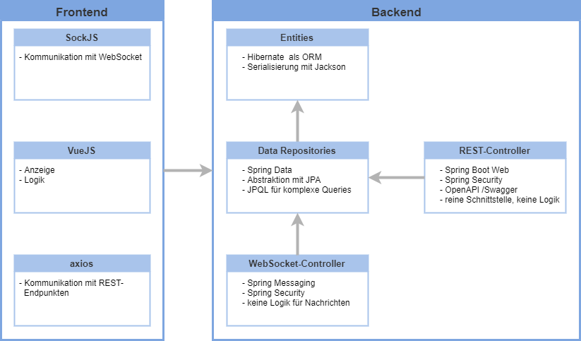

# PIB-VS_WS2020_Gruppe1
Das Projekt kam im Rahmen der Vorlesung Verteilte Systeme auf. 
Ziel des Projekts war es eine Verwaltung von verteilten Anzeigetafeln zum Verbreiten und Teilen von Informationen in einer Organisation bereitzustellen.
Jede dieser Anzeigetafeln wird einer lokalen Nutzergruppe zugeordnet und jeder Nutzer innerhalb der Gruppe darf Nachrichten auf seine Gruppentafel publizieren.
Jeder Nutzer darf seine eigenen Nachrichten auch modifizieren und löschen. Zu jeder Gruppe wird ein Koordinator definiert, der alle Nachrichten auf der Gruppentafel 
manipulieren kann. Zusätzlich zu den Gruppentafeln existiert auch eine zentrale Tafel. 
Die Koordinatoren der Gruppen haben die Möglichkeit eine Nachricht ihrer Gruppentafel auf der zentralen Anzeigetafel öffentlich zu machen.
Die Software kann sowohl von Nutzern, als auch Koordinatoren genutzt werden, um Nachrichten publizieren. Zudem soll die Anzeige realisiert werden.
Neben den beiden Rollen Nutzer und Koordinator soll es noch eine administrative Rolle (Supervisor) geben. 
Supervisor können Stammdaten, wie Gruppen, Anzeigetafeln und Nutzer erstellen, löschen und modifizieren. 
Im Rahmen des Projektes sollen sowohl das Frontend, als auch das Backend zu dieser Verwaltungssoftware programmiert werden.


Der Kern des Systems ist das Backend, über das die gesamte Kommunikation abläuft. Hierbei handelt es sich um einen auf Spring Boot basierten Service.
Das Backend stellt eine REST-API bereit über die  eine administrative Verwaltung durchgeführt werden kann. Zudem stellt sie diverse Funktionen zur Abfrage von Stammdaten bereit.
Dazu wird eine Vielzahl von Endpunkten bereitgestellt, mit denen alle Daten abgefragt, verändert oder erzeugt werden können.
Ebenso realisiert das Backend eine Verbindung zu dem RabbitMQ Message Broker über die Websocket-Technologie. 
Dazu werden STOMP-Endpunkte bereitgestellt. Über diese werden Funktionen zum Senden und Erhalten von aktiven Nachrichten auf den Anzeigetafeln zur Verfügung gestellt.

Eine weitere Komponente ist das Frontend. Das Frontend kommuniziert mit der REST-Schnittstelle und den Websocket-Endpunkten. Es fragt die relevanten Daten ab, um eine Anzeige
von Anzeigetafeln und deren Nachrichten zu ermöglichen. Es stellt Nutzern auch eine Möglichkeit bereit eigene Daten zu verwalten. Koordinatoren können die Stammdaten ihrer
jeweiligen Tafel bearbeiten und Supervisor den gesamten Datenbestand. Dazu können diverse Admin Panels genutzt werden.

## Architektur
Wie oben beschrieben ist, sind zwei verschiedene Komponenten zu implementieren. Es muss das Backend implementiert werden, welches die Logik darstellt, 
sowie das Frontend, welches im Wesentlichen die Anzeige realisiert.
Bei der Erarbeitung der Lösungsstrategie mussten die internen Abläufe zur Anzeige und zum Senden der Nachrichten definiert werden. 
Dabei konnte seitens des Backends die WebSocket- und die REST-Schnittstelle unabhängig voneinander ausgearbeitet werden.
Im Folgenden wird auf die wesentlichen Schritte bis zur Fertigstellung eingegangen.

#### User Stories und Use Cases
* User Stories
    * Als Nutzer möchte ich:
        * Nachrichten auf Tafeln publizieren
        * Meine Nachrichten bearbeiten und löschen
        * Sehen welchen Gruppen ich angehöre
    * Als Koordinator möchte ich:
        * Nachrichten meiner Gruppe auf die zentrale Tafel publizieren
        * Nachrichten meiner Gruppe verwalten
        * Mitglieder meiner Gruppe verwalten
    * Als Supervisor möchte ich:
        * Gruppen und Nutzer erstellen und verwalten
        * Sämtliche Nachrichten und Tafeln verwalten 
        * Nutzer zu Koordinatoren machen
* Use Cases
    * Live-Vorschau einer Tafel für Nutzer
    * Einstellbare Anzeigedauer von Nachrichten
    * Verschiedene Anzeigemöglichkeiten von Nachrichten
    * Log aller Nachrichten

#### Anforderungen

##### Must-Have-Anforderungen:

###### Funktionale Anforderungen:
Nutzer:
 - Nachrichten publizieren, bearbeiten und löschen
 - Gruppenangehörigkeit einsehen
Koordinatoren:
 - Nachrichten auf die zentrale Tafel publizieren
 - Nachrichten der eigenen Gruppe verwalten
 - Mitglieder ihrer Gruppe verwalten
Supervisor:
 - Alle Nachrichten verwalten
 - Gruppen, Nutzer und Berechtigungen verwalten

###### Nichtfunktionale Anforderungen:
- Containerisierung mit Docker
- Nutzung von Spring Boot
- REST-Schnittstelle zur Bereitstellung verwenden
- WebSockets zur Kommunikation, STOMP als Protokoll  
- RabbitMQ als Message Broker verwenden
- Hibernate als ORM
- Vue.js für FrontEnd
- SockJS

##### Should-Have-Anforderungen:

###### Funktionale Anforderungen:
- Live-Vorschau der eigenen Nachrichten für Nutzer
- Übersicht aktiver Nachrichten für Nutzer
- Dauer der Anzeige für Nachrichten durch Koordinator einstellbar

##### Nice-To-Have-Anforderungen:

###### Funktionale Anforderungen:
- Darstellung von Nachrichten bearbeitbar
- Log aller Nachrichten für Supervisor

#### Lösungsstrategie
Die Lösung wurde in Java 11 implementiert. Das Spring Framework wurde eingesetzt, um
die Web Sockets und damit auch die Kommunikation mit dem Message Broker abzubilden. 
Die Bibliothek stellt Logik für Clients bereit. Sie ermöglicht das Senden von Nachrichten auf 
selbst definierten Topics. Im Frontend wird dann SockJS genutzt, um die Topics zu abonnieren.
Das Abonnement macht es dann möglich Nachrichten von Nutzern zu empfangen.
Im Folgenden wird die Methodik der Umsetzung beschrieben. Die Frontend-Clients authentifizieren einen 
Nutzer und fragen dessen Stammdaten über die REST-API an. 
Die Stammdatenhaltung erfolgt in einer MySQL-Datenbank. Zur Abbildung der Datenbank-Entitäten
in Java wurde JPA (Java Persistence API) und Hibernate eingesetzt. Bei Hibernate handelt es sich um ein ORM-Tool. 
ORM steht für Object-relational mapping, was eine Technik zur Umwandlung von Daten in Objekte ist.
JPA erleichtert die Arbeit mit den Objekten, indem es Standardfunktionen, wie Speichern, Aktualisieren und Löschen 
bereitstellt. Zudem ermöglicht es eine schnelle Implementierung von neuen Funktionen, da es automatisch Queries
auf Basis von Namenskonventionen erzeugt, ohne dass man diese selbst definieren muss. Für komplexere Abfragen
kann JPQL (Java Persistence Query language) verwendet werden. Hier muss dann lediglich die Abfrage angegeben werden, 
alles weitere realisiert JPA. Nach erfolgreichem Login und der damit
einhergehende Assoziation zu Gruppen, bzw. Anzeigetafeln stehen dem Nutzer folgende Funktionen bereit.
Er kann auf den Tafeln die aktiven Nachrichten einsehen oder neue Nachrichten senden. 
Dazu findet eine Subscription zu den Topics der ihm zugehörigen Anzeigetafeln statt. Sendet er eine Nachricht, 
so wird ein Web Socket Endpunkt vom Backend aufgerufen. Dieser verifiziert die Daten und speichert die Nachricht.
Anschließend sendet das Backend die Nachricht auf dem Topic der 
jeweiligen Anzeigetafel. Dadurch erhalten alle Tafeln und Nutzer, die diesem Topic folgen ebenso 
die Nachricht und können sich diese anzeigen lassen.  

###### Message Broker und Security
RabbitMQ ist ein weitverbreiteter Open Source Message Broker. Man spricht auch von
Message Oriented Middleware (MOM). RabbitMQ kann verschiedene Protokolle verwenden.
Dazu zählen unter anderem Advanced Message Queuing Protocol (AMQP), Streaming Text Oriented Messaging Protocol (STOMP),
MQ Telemetry Transport (MQTT). Um RabbitMQ zu verwenden, muss das Server Programm, also der Message Broker
eingesetzt werden. Dieser muss auf einem Server installiert und konfiguriert werden. 
Die Verbindung wird mittels Spring Security gesichert. Spring Security wird als Standard zur Gewährleistung
von kryptografischer Sicherheit bei Spring-basierten Anwendungen angesehen. Gemäß dem CIA-Prinzip
sind Bedrohungen festgelegt als Verlust von Vertraulichkeit, Integrität und
Verfügbarkeit. Spring ermöglicht eine Authentifizierung per Username und Passwort. Diese Authentifizierung wird 
automatisch über HTTP-Header realisiert und muss lediglich in Spring Security richtig konfiguriert werden. 
Des Weiteren wird die Vergabe von Rollen an Nutzer ermöglicht. Über diese Rollen können die Endpunkte der REST-API,
sowie der WebSockets auf bestimmte Nutzergruppen eingeschränkt werden. Möchte ein Client eine
Verbindung aufbauen, so authentifiziert er sich. Anschließend wird geprüft, ob der Zugriff erlaubt wird.
Über die jeweiligen HTTP Statuscodes kann dem Nutzer dann ggf. mitgeteilt werden, dass seine Privilegien
für den Zugriff auf den jeweiligen Endpunkt nicht ausreichen. Spring stellt ebenso eine gute Möglichkeit
zum Kodieren von Passwörtern und deren sichere Übermittlung bereit. Dazu wird der bcrypt Algorithmus
eingesetzt. Dieser zeigt insbesondere gegen Brute Force Angriffe eine große Widerstandsfähigkeit, da
er absichtlich langsam arbeitet. 

###### Administrative Verwaltung
Man kann über die REST-Schnittstelle sämtliche Stammdaten verwalten. Bei der Verbindung mit der REST-Schnittstelle wird 
der Nutzer authentifiziert.
Die REST-API wird gleichermaßen wie die WebSocket-Endpunkte über Spring Security abgesichert.
Die Schnittstelle stellt Funktionen zur Anlage von Anzeigetafeln und deren Gruppen bereit. Ebenso können Nutzer angelegt
und modifiziert werden. Alte Nachrichten können ausgelesen
und ggf. reaktiviert werden. Diese Funktionen stehen im Frontend in den Admin Panels bereit. Je nachdem welche Rolle ein
angemeldeter Nutzer hat,
sieht er mehr Stammdaten und ihm stehen mehr Möglichkeiten bereit diese zu bearbeiten.

###### Fehlerbehandlung
Im Falle eines Fehlers bei Verbindung oder Zugriff auf die Endpunkte werden entsprechende Fehlercodes
zurückgegeben. Zusätzlich werden aussagekräftige Fehlermeldungen mitgeliefert, sowie weitere Details, 
die gegebenenfalls Aufschluss geben können. Häufig auftretende Fehler, wie falsche Eingaben oder Verstöße
gegen Datenbank-Constraints werden im Frontend abgefangen und direkt verarbeitet. Dadurch wird eine gute
User Experience sichergestellt.


###### Frontend
Das Frontend ist eine VueJS-basierte Single Page Application, welche sowohl zur administrativen Verwaltung der Anzeigetafeln und Gruppen genutzt wird, als auch die Kernfunktionalität für Anzeigetafeln bereitzustellen.
Es Frontend fordert den Nutzer zunächst auf, sich einzuloggen. Sobald der Nutzer erfolgreich authentifiziert ist, wird automatisch ein Websocket zum Backend aufgebaut sowie die aktuellen Nachrichten der Boards, denen der Nutzer angehört, abgefragt. Ab dann wird das Frontend automatisch benachrichtigt, sobald sich die Nachricht der Boards ändern und die Ansicht im Frontend automatisch aktualisiert. Falls sich die Boards auf die der User Zugriff hat ändern (etwa weil ein neues Board hinzugefügt oder ein Board entfernt wurde) wird der Websocket geschlossen und neu aufgebaut. Somit ist sichergestellt, dass das Frontend jederzeit über den aktuellsten Stand informiert ist, ohne selbst "aktiv" werden zu müssen.


#### Statisches Modell
##### ERM-Modell


##### Bausteinsicht
Im Folgenden ist eine grafische Darstellung der Systembausteine und die eingesetzten Technologien und Frameworks zu sehen.


##### Verteilungssicht
Das Backend, Frontend, die Datenbank und der RabbitMQ Message Broker laufen in separaten Containern auf der selben Maschine.
Das Frontend kann über eine URL aufgerufen werden und je nach Konfiguration kann so eine Anzeigetafel oder eine Anwendung
für einen Nutzer abgebildet werden. 


##### Klassendiagramm
###### Backend


##### API

###### RabbitMQ-Topics
* Topic-Präfix in Konfigurationsdatei festlegbar
* Anzeigetafeln über Präfix gefolgt von eindeutiger Nummer unterscheidbar


###### Rest
Die REST-API des Backends ist konform mit der OpenAPI-Spezifikation und stellt unter dem Endpunkt
`/swagger-ui.html` eine grafische Oberfläche mit Details zur Spezifikation bereit. Des Weiteren
können auf dieser Oberfläche sämtliche Endpunkte ausprobiert werden.

Die JSON-basierte OpenAPI-Spezifikation steht unter `/v3/api-docs` bereit.


#### Dynamisches Modell
###### Allgemeiner Ablauf
Nach erfolgtem Login findet die Assoziation von Nutzer und Boards statt. Es werden die aktiven Nachrichten der jeweiligen
Anzeigetafeln geladen und die Anzeige erfolgt. Anschließend wird das Senden von Nachrichten möglich.
Der Koordinator kann zudem Nachrichten auswählen und auf der definierten zentralen Anzeigetafel publizieren.
Die Abläufe dieser Prozesse wird im nachfolgenden Sequenzdiagramm abgebildet. 


## Getting Started
````
git clone https://github.com/htw-saar/PIB-VS_WS2020_Gruppe1.git
````
Der Build-Prozess ist vollständig in Form von Dockerfiles realisiert und somit nahtlos mit dem Deployment verbunden. Die [docker-compose.yml](/docker-compose.yml) definiert die für die Ausführung der Anwendung benötigten Services:
- MySQL Datenbank
- RabbitMQ Broker (mit aktiviertem STOMP-Plugin)
- Spring Boot Backend & Frontend

### Deployment via Docker Compose
Die gesamte Anwendung kann sehr schnell aus dem Quellcode erzeugt werden und mit allen benötigten Diensten via Docker Compose deployed werden. Die [docker-compose.yml](/docker-compose.yml)-Datei enthält die entsprechende Konfiguration, einige Einstellungen sind unter Rücksicht auf die Benutzerfreundlichkeit gewählt und sollten vor einem Deployment in einer Produktionsumgebung sorgfältig angepasst werden.

Sobald dieses Repository mittels
````
git clone https://github.com/htw-saar/PIB-VS_WS2020_Gruppe1.git
````
geklont wurde und Docker sowie Docker Compose auf dem System installiert sind, kann der Build- und Deployment-Prozess mittels
````
docker-compose up -d --build
````
angestoßen werden.

Die Services `db_mysql` sowie `phpmyadmin` sind nur Definitionen von Services, welche bestehnde Docker Images von dockerhub nutzen. `phpmyadmin` ist dabei ein optionaler Service, welcher ein Webinterface zur Datenbankadministration bereitstellt.
Der Service `rabbitmq` ist mittels [Dockerfile](/docker/rabbitmq/Dockerfile) definiert, das Image besteht aus dem Standard `rabbitmq`-Image, in welchem das Stomp-Plugin aktiviert ist.
Der Service `distributed-boards` wird durch eine eigene [Dockerfile](/docker/distributed-boards/Dockerfile) definiert, der Build läuft folgendermaßen ab:
- In einem temporären node-Container wird die VueJS Frontend-Anwendung mit der Flag `--mode production` gebaut.
- Der erzeugte Code wird in einen anderen temporären Container kopiert, welcher den Quellcode für das Backend beinhaltet
- Im zweiten temporären Container wird mittels `mvn package` das Backend kompiliert
- In einem dritten temporären Container wird das das kompilierte Backend als .jar-Datei verpackt. Das Frontend ist zu diesem Zeitpunkt darin enthalten und das Backend dient neben seiner Kernfunktionalität auch als statischer Host für den Code der Frontend-Anwendung. Dies dient ausschließlich der Einfachheit, das Frontend könnte auch von unabhängigen Servern gehostet oder lokal ausgeführt werden.

#### Variante: Deployment auf Docker Swarm
Docker Swarm kann als eine erweiterte Version von Docker Compose gesehen werden. Es handelt sich dabei um ein relatives neues Docker-feature, welches eine simple Containerorchestrierung bietet, die über die Standardfunktionalität von Docker hinausgehen. Dieses Projekt kann ebenfalls in einem Docker Swarm deployed werden. In der vorliegenden [docker-compose.yml](/docker-compose.yml) sind die Images `rabbitmq` und `distributed-boards` jeweils mit dem Präfix `127.0.0.1` versehen. Wenn eine lokale Docker-Registry (z.B. mittels [registry](https://hub.docker.com/_/registry)) zur Verfügung steht, können die im `docker-compose up -d --build` erzeugten Docker Images mittels `docker-compose push` in diese lokale Registry aufgenommen werden. In einem Docker Swarm kann die [docker-compose](docker-compose.yml) nun mit
````
docker stack deploy --compose-file docker-compose.yml <name>
````
deployed werden (name durch gewünschten Stacknamen ersetzen).


### Lokale Installation / Entwicklung
`mysql` und `rabbitmq` mit aktivierter STOMP-Erweiterung sind unbedingt notwendige Abhängigkeiten der Anwendung und müssen daher auch beim Entwickeln und Testen zur Verfügung stehen. Lokal kann dies entweder durch Installation dieser Anwendungen geschehen, oder alternativ über das Verwenden der [docker-compose-local-env.yml](/docker-compose-local-env.yml) geschehen:
````
docker-compose up -d -f ./docker-compose-local-env.yml
````
Die Standartwerte in der Konfiguration des Backends entsprechen dieser Installationsmethode.

###### Konfiguration
Sämtliche Konfigurationseigenschaften können entweder in `src/main/resources/application.properties` eingetragen oder beim Erstellen des Containers als Umgebungsvariablen übergeben werden. 
Die wichtigsten Konfigurationseigenschaften sind:
* `spring.datasource.url`: Url zur Datenbank. Bei der Ausführung der Datenbank als Container im selben Docker-Netzwerk kann anstelle einer IP oder eines 
Host-Namens der Name des entsprechenden Docker-Containers eingetragen werden.
* `spring.datasource.username`: Username zur Authentifizierung gegenüber der Datenbank 
* `spring.datasource.password`: Password zur Authentifizierung gegenüber der Datenbank
* `server.port`: Server Port der Backend-Anwendung
* `BROKER_HOST`: URL des RabbitMQ Message Brokers
* `BROKER_PORT`: Port des RabbitMQ Message Brokers
* `BROKER_LOGIN`: Username zur Authentifizierung gegenüber dem Broker
* `BROKER_PASSCODE`: Password zur Authentifizierung gegenüber dem Broker
* `BASIC_TOPIC`: Topic unter dem die Nachrichten auf den Anzeigetafeln publiziert werden, z.B. `/topic/boards.`.
Ein Board mit eindeutiger Nummer 1 würde in diesem Fall unter `/topic/boards.1` seine Nachrichten publizieren
* `DEFAULT_SUPERVISOR_PASSWORD`: Initiales Supervisor-Passwort zum Authentifizieren gegenüber der REST-Schnittstelle
* `CENTRAL_BOARD_NAME`: Name der zentralen Anzeigetafel

## Built With
* [Spring Boot](https://spring.io/projects/spring-boot) - Das allmächtige Framework
* [Swagger](https://swagger.io/) / [springdoc](https://springdoc.org/) - OpenAPI-Konforme Schnittstellenspezifikation
* [Maven](https://maven.apache.org/) - Verwaltung von Abhängigkeiten, Build-Prozess
* [Hibernate](https://hibernate.org/orm/) - Object-Relationales Mapping
* [Spring Data JPA](https://spring.io/projects/spring-data-jpa) - Library zur Datenabfrage  
* [MySQL](https://www.mysql.com/) - Datenbanksystem
* [JUnit](https://junit.org/) - Framework zum Testen
* [H2 Database Engine](https://www.h2database.com/html/main.html) - In-Memory Datenbank
* [Docker](https://www.docker.com/) - Anwendung zur Containervirtualisierung
* [Vue.js](https://vuejs.org/) - FrontEnd Implementierung
* [SockJS](https://github.com/sockjs) - Kommunikation mit WebSockets in JS
* [Vue Material](https://vuematerial.io/) - Material Design und Layout
* [axios](https://github.com/axios/axios) - Kommunikation mit REST-API in JS
* [Stomp](https://github.com/stomp-js/stompjs) - Stellt STOMP über Websocket für JS bereit


## License
This project is licensed under the GNU General Public License v3.0

## Acknowledgments
* [Prof. Dr. Markus Esch](https://www.htwsaar.de/htw/ingwi/fakultaet/personen/profile/markus-esch) - Projektbetreuung
* [Baeldung](https://www.baeldung.com/) - Große Auswahl an Spring Boot-fokussierten Guides
* [Sprint Data JPA - Reference Documentation](https://docs.spring.io/spring-data/jpa/docs/1.5.0.RELEASE/reference/html/index.html) - Dokumentation über Spring Data JPA
* [RabbitMQ](https://www.rabbitmq.com/) - RabbitMQ Dokumentation, Guides für Server und Client Konfiguration und Deployment
* [phpMyAdmin](https://www.phpmyadmin.net/) - Bereitstellung von MySQL-Datenbanken
* [Rameez Shaikh](https://medium.com/@rameez.s.shaikh/build-a-chat-application-using-spring-boot-websocket-rabbitmq-2b82c142f85a) - Chat Application Beispiel mit guter Erklärung
* [Stackoverflow](https://stackoverflow.com/) - :ok_man:
