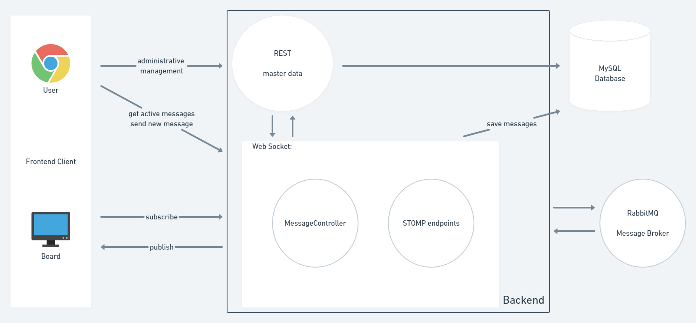

# PIB-VS_WS2020_Gruppe1
//todo coole Einleitung



Der Kern des Systems ist das Backend, über das die gesamte Kommunikation abläuft. Hierbei handelt es sich um einen auf Spring Boot basierten Service.
Das Backend stellt eine REST-API bereit über die  eine administrative Verwaltung durchgeführt werden kann. Zudem stellt sie diverse Funktionen zur Abfrage von Stammdaten bereit.
Dazu wird eine Vielzahl von Endpunkten bereitgestellt, mit denen alle Daten abgefragt, verändert oder erzeugt werden können.
Ebenso realisiert das Backend eine Verbindung zu dem RabbmitMQ Message Broker über die Websocket-Technologie. 
Dazu werden STOMP-Endpunkte bereitgestellt. Über diese werden Funktionen zum Senden und Erhalten von aktiven Nachrichten auf den Anzeigetafeln zur Verfügung gestellt.

Eine weitere Komponente ist das Frontend. Das FrontEnd kommuniziert mit der REST-Schnittstelle und den Websocket-Endpunkten. Es fragt die relevanten Daten ab, um eine Anzeige
von Anzeigetafeln und deren Nachrichten zu ermöglichen. Es stellt Nutzern auch eine Möglichkeit bereit eigene Daten zu verwalten. Koordinatoren können die Stammdaten ihrer
jeweiligen Tafel bearbeiten und Supervisor den gesamten Datenbestand. Dazu können diverse Admin Panels genutzt werden.

## Architektur
Wie oben beschrieben ist, handelt es sich um einen Microservice, der Teil des Backends ist. Der Aggregator Service ist in seiner Funktionalität abhänig vom MQTT Broker.
Bei der Erarbeitung der Lösungsstrategie musste die Datenverarbeitung der Sensormesswerte festgelegt werden. Als separate Aspekte musste die Batch-Aggregation und
die Datenbereitstellung konzipiert werden. Diese drei Kernfunktionen des Service konnten im Einzelnen konzipiert werden. Im Folgenden werden diese beschrieben.

#### User Stories und Use Cases
* User Stories
    * Als Nutzer möchte ich:
        * Nachrichten auf Tafeln publizieren
        * Meine Nachrichten bearbeiten und löschen
        * Sehen welchen Gruppen ich angehöre
    * Als Koordinator möchte ich:
        * Nachrichten meiner Gruppe auf die zentrale Tafel publizieren
        * Nachrichten meiner Gruppe verwalten
        * Mitglieder meiner Gruppe verwalten
    * Als Supervisor möchte ich:
        * Gruppen und Nutzer erstellen und verwalten
        * Sämtliche Nachrichten und Tafeln verwalten 
        * Nutzer zu Koordinatoren machen
* Use Cases
    * Live-Vorschau einer Tafel für Nutzer
    * Einstellbare Anzeigedauer von Nachrichten
    * Verschiedene Anzeigemöglichkeiten von Nachrichten
    * Log aller Nachrichten


#### Anforderungen

##### Must-Have-Anforderungen:

###### Funktionale Anforderungen:
Nutzer:
 - Nachrichten publizieren, bearbeiten und löschen
 - Gruppenangehörigkeit einsehen
Koordinatoren:
 - Nachrichten auf die zentrale Tafel publizieren
 - Nachrichten der eigenen Gruppe verwalten
 - Mitglieder ihrer Gruppe verwalten
Supervisor:
 - Alle Nachrichten verwalten
 - Gruppen, Nutzer und Berechtigungen verwalten


###### Nichtfunktionale Anforderungen:
- Containerisierung mit Docker
- Nutzung von Spring Boot
- REST-Schnittstelle zur Bereitstellung verwenden
- WebSockets zur Kommunikation, STOMP als Protokoll  
- RabbitMQ als Message Broker verwenden
- Hibernate als ORM
- Vue.js für FrontEnd
- SockJS

##### Should-Have-Anforderungen:

###### Funktionale Anforderungen:
- Live-Vorschau der eigenen Nachrichten für Nutzer
- Übersicht aktiver Nachrichten für Nutzer
- Dauer der Anzeige für Nachrichten durch Koordinator einstellbar


##### Nice-To-Have-Anforderungen:

###### Funktionale Anforderungen:
- Darstellung von Nachrichten bearbeitbar
- Log aller Nachrichten für Supervisor


#### Lösungsstrategie
Die Lösung wurde in Java 11 implementiert. Das Spring Framework wurde eingesetzt, um
die Web Sockets und damit auch die Kommunikation mit dem Message Broker abzubilden. 
Die Bibliothek stellt Logik für Clients bereit. Sie ermöglicht das Senden von Nachrichten auf 
selbst definierten Topics. Im FrontEnd wird dann SockJS genutzt, um die Topics zu abonnieren.
Das Abonnement macht es dann möglich Nachrichten von Nutzern zu empfangen.
Im Folgenden wird die Methodik der Umsetzung beschrieben. Die FrontEnd-Clients authentifizieren einen 
Nutzer und fragen dessen Stammdaten über die REST-API an. 
Die Stammdatenhaltung erfolgt in einer MySQL-Datenbank. Zur Abbildung der Datenbank-Entitäten
in Java wurde JPA (Java Persistence API) und Hibernate eingesetzt. Bei Hibernate handelt es sich um ein ORM-Tool. 
ORM steht für Object-relational mapping, was eine Technik zur Umwandlung von Daten in Objekte ist.
JPA erleichtert die Arbeit mit den Objekten, indem es Standardfunktionen, wie Speichern, Aktualisieren und Löschen 
bereitstellt. Zudem ermöglicht es eine schnelle Implementierung von neuen Funktionen, da es automatisch Queries
auf Basis von Namenskonventionen erzeugt ohne, dass man diese selbst definieren muss. Für komplexere Abfragen
kann JPQL (Java Persistence Query language) verwendet werden. Hier muss dann lediglich die Abfrage angegeben werden, 
alles weitere realisiert JPA. Nach erfolgreichem Login und der damit
einhergehende Assoziation zu Gruppen, bzw. Anzeigetafeln stehen dem Nutzer Funktionen bereit.
Er kann auf den Tafeln die aktiven Nachrichten einsehen oder neue Nachrichten senden. 
Dazu findet eine Subscription zu den Topics der ihm zugehörigen Anzeigetafeln statt. Sendet er eine Nachricht, 
so wird ein Web Socket Endpunkt vom Backend aufgerufen. Dieser verifiziert die Daten und speichert die Nachricht.
Anschließend sendet das Backend die Nachricht auf dem Topic der 
jeweiligen Anzeigetafel. Dadurch erhalten alle Tafeln und Nutzer, die diesem Topic folgen ebenso 
die Nachricht und können diese anzeigen.  

###### RabbitMQ als Message Broker
RabbitMQ ist ein weitverbreiteter Open Source Message Broker. Man spricht auch von
Message Oriented Middleware (MOM). RabbitMQ kann verschiedene Protokolle verwenden.
Dazu zählen unter anderem Advanced Message Queuing Protocol (AMQP), Streaming Text Oriented Messaging Protocol (STOMP),
MQ Telemetry Transport (MQTT). Um RabbitMQ zu verwenden, muss das Server Programm, also der Message Broker
eingesetzt werden. Dieser muss auf einem Server installiert und konfiguriert werden. 
Die Verbindung wird mittels Spring Security gesichert. Spring Security wird als Standard zur Gewährleistung
von kryptografischer Sicherheit bei Spring-basierten Anwendungen angesehen. Gemäß dem CIA-Prinzip
sind Bedrohungen festgelegt als Verlust von Vertraulichkeit, Integrität und
Verfügbarkeit.  Spring ermöglicht  eine Authentifizierung per Username und Passwort. Diese Authentifizierung wird 
automatisch über HTTP-Header realisiert und muss lediglich in Spring Security richtig konfiguriert werden. 
Des Weiteren wird die Vergabe von Rollen an Nutzer ermöglicht. Über diese Rollen können die Endpunkte der REST-API,
sowie der Websockets auf bestimmte Nutzergruppen eingeschränkt werden. Möchte ein Client eine
Verbindung aufbauen, so authentifiziert er sich. Anschließend wird geprüft, ob der Zugriff erlaubt wird.
Über die jeweiligen HTTP Statuscodes kann dem Nutzer dann ggf. mitgeteilt werden, dass seine Privilegien
für den Zugriff auf den jeweiligen Endpunkt nicht ausreichen. Spring stellt ebenso eine gute Möglichkeit
zum Kodieren von Passwörtern und deren sichere Übermittlung bereit. Dazu wird der bcrypt Algorithmus
eingesetzt. Dieser zeigt insbesondere gegen Brute Force Angriffe eine große Widerstandsfähigkeit, da
er absichtlich langsam arbeitet. 


###### some more Backend stuff
// todo: explain some more Backend stuff

###### Bereitstellung für das FrontEnd
Die eingehenden Nachrichten werden von den FrontEnds empfangen. Neue Nachrichten können versendet werden, indem mit dem Backend
kommuniziert wird. 
//todo: add some FrontEnd gebrabbel

###### Administrative Verwaltung
Man kann über die REST-Schnittstelle sämtliche Stammdaten verwalten. Bei der Verbindung mit der REST-Schnittstelle wird der Nutzer authentifiziert.
Es stehen Funktionen zur Anlage von Anzeigetafeln und deren Gruppen bereit. Ebenso können Nutzer angelegt und modifiziert werden. Alte Nachrichten können ausgelesen
und ggf. reaktiviert werden. Diese Funktionen stehen im FrontEnd in den Admin Panels bereit. Je nachdem welche Rolle ein angemeldeter Nutzer hat,
sieht er mehr Stammdaten und ihm stehen mehr Möglichkeiten bereit diese zu bearbeiten.


###### Fehlerbehandlung
Im Falle eines Fehlers bei Verbindung oder Zugriff auf die Endpunkte werden entsprechende Fehlercodes
zurückgegeben. Zusätzlich werden aussagekräftige Fehlermeldungen mitgeliefert, sowie weitere Details, 
die gegebenenfalls Aufschluss geben können. Häufig auftretende Fehler wie falsche Eingaben oder Verstöße
gegen Datenbank-Constraints werden im FrontEnd abgefangen und direkt verarbeitet. Dadurch wird eine gute
User Experience sichergestellt.

#### Statisches Modell
##### ERM-Modell


##### Bausteinsicht
Im Folgenden ist eine grafische Darstellung der Systembausteine und die eingesetzten Technologien und Frameworks zu sehen.


##### Verteilungssicht
Das Backend, FrontEnd, die Datenbank und der RabbitMQ Message Broker laufen in separaten Containern auf derselben Maschine.
Das FrontEnd kann über eine URL aufgerufen werden und je nach Konfiguration kann so eine Anzeigetafel oder eine Anwendung
für einen Nutzer abgebildet werden. 


##### Klassendiagramm


##### API

###### RabbmitMQ-Topics
* Topic-Präfix in Konfigurationsdatei festlegbar
* Anzeigetafeln über Präfix gefolgt von eindeutiger Nummer unterscheidbar


###### Rest
Die REST-API des Backends ist konform mit der OpenAPI-Spezifikation und stellt unter dem Endpunkt
`/swagger-ui.html` eine grafische Oberfläche mit Details zur Spezifikation bereit. Des Weiteren
können auf dieser Oberfläche sämtliche Endpunkte ausprobiert werden.

Die JSON-basierte OpenAPI-Spezifikation steht unter `/v3/api-docs` bereit.


#### Dynamisches Modell
###### Allgemeiner Ablauf


###### one more pls


## Getting Started
//todo  
Um dieses Projekt lokal aufzusetzen, muss zuerst dieses Git-Repository geklont werden:
````
git clone https://github.com/htw-saar/SmartCityAggregatorService.git
````
Anschließend kann das Projekt in einer beliebigen IDE bearbeitet werden.

Der Build-Prozess ist mit Maven realisiert. Wichtige Phasen:
- `mvn package`: Kompiliert das Projekt, erstellt eine ausführbare `.jar` mit allen benötigten Dependencies
- `mvn install`: Erstellt ein Docker-Image, welches eine JRE sowie die ausführbare `.jar` als Entry-Point enthält. Wird im lokalen Docker Repository abgelegt. 
Ein Docker-Agent muss lokal verfügbar sein, um diese Phase auszuführen.
- `mvn deploy`: Das generierte Docker-Image wird zu der in der `pom.xml` definierten Docker-Registry gepusht.

#### Vorraussetzungen
//todo
Es müssen folgende Abhängigkeiten auf dem Rechner installiert sein:
- [JDK 11](https://www.oracle.com/java/technologies/javase-jdk11-downloads.html)
- [Maven](https://maven.apache.org/download.cgi)
- [Docker](https://www.docker.com/get-started) (für Maven Phasen `install`, `deploy`)

#### Installation und Deployment
//todo
Das Docker-Image kann mit `docker run {registry}/htw.smartcity/aggregator:1.0-SNAPSHOT` ausgeführt werden, wobei `{registry}`
durch die entsprechende Registry ersetzt werden muss.

Um die MySQL-Datenbank ebenfalls als Container auf demselben Host bereitzustellen ist es erforderlich, via `docker network create --driver bridge {name}` ein Docker-Netzwerk anzulegen und 
beide Container mit diesem Network zu verbinden. Dazu muss der `docker run`-Befehl um `--net={name}` erweitert werden.
Es empfiehlt sich, dem Datenbank-Container explizit einen Namen zu geben, denn dadurch kann der Aggregator-Service die IP auflösen (siehe "Konfiguration").

###### Konfiguration
Sämtliche Konfigurationseigenschaften können entweder in `src/main/resources/application.properties` eingetragen oder beim Erstellen des Containers als Umgebungsvariablen übergeben werden. 
Die wichtigsten Konfigurationseigenschaften sind:
* `spring.datasource.url`: Url zur Datenbank. Bei der Ausführung der Datenbank als Container im selben Docker-Netzwerk kann anstelle einer IP oder eines 
Hostnamens der Name des entsprechenden Docker-Containers eingetragen werden.
* `spring.datasource.username`: Username zur Authentifizierung gegenüber der Datenbank 
* `spring.datasource.password`: Password zur Authentifizierung gegenüber der Datenbank
* `server.port`: Server Port der Backend-Anwendung
* `BROKER_HOST`: URL des RabbitMQ Message Brokers
* `BROKER_PORT`: Port des RabbitMQ Message Brokers
* `BROKER_LOGIN`: Username zur Authentifizierung gegenüber dem Broker
* `BROKER_PASSCODE`: Password zur Authentifizierung gegenüber dem Broker
* `BASIC_TOPIC`: Topic unter dem die Nachrichten auf den Anzeigetafeln publiziert werden, z.B. `/topic/boards.`.
Ein Board mit eindeutiger Nummer 1 würde in diesem Fall unter `/topic/boards.1` seine Nachrichten publizieren
* `DEFAULT_SUPERVISOR_PASSWORD`: Initiales Supervisor-Passwort zum Authentifizieren gegenüber der REST-Schnittstelle
* `CENTRAL_BOARD_NAME`: Name der zentralen Anzeigetafel

## Built With
* [Spring Boot](https://spring.io/projects/spring-boot) - Das allmächtige Framework
* [Swagger](https://swagger.io/) / [springdoc](https://springdoc.org/) - OpenAPI-Konforme Schnittstellenspezifikation
* [Maven](https://maven.apache.org/) - Abhängigkeitenverwaltung, Build-Prozess
* [Hibernate](https://hibernate.org/orm/) - Object-Relationales Mapping
* [Spring Data JPA](https://spring.io/projects/spring-data-jpa) - Library zur Datenabfrage  
* [MySQL](https://www.mysql.com/) - Datenbanksystem
* [JUnit](https://junit.org/) - Framework zum Testen
* [H2 Database Engine](https://www.h2database.com/html/main.html) - In-Memory Datenbank
* [Docker](https://www.docker.com/) - Anwendung zur Containervirtualisierung
* [Vue.js](https://vuejs.org/) - FrontEnd Implementierung
* [SockJS](https://github.com/sockjs) - Kommunikation mit WebSockets in JS


## License
This project is licensed under the GNU General Public License v3.0

## Acknowledgments
* [Prof. Dr. Markus Esch](https://www.htwsaar.de/htw/ingwi/fakultaet/personen/profile/markus-esch) - Projektbetreuung
* [Baeldung](https://www.baeldung.com/) - Große Auswahl an Spring Boot-fokussierten Guides
* [Sprint Data JPA - Reference Documentation](https://docs.spring.io/spring-data/jpa/docs/1.5.0.RELEASE/reference/html/index.html) - Dokumentation über Spring Data JPA
* [RabbitMQ](https://www.rabbitmq.com/) - RabbmitMQ Dokumentation, Guides für Server und Client Konfiguration und Deployment
* [phpMyAdmin](https://www.phpmyadmin.net/) - Bereitstellung von MySQL-Datenbanken
* [Rameez Shaikh](https://medium.com/@rameez.s.shaikh/build-a-chat-application-using-spring-boot-websocket-rabbitmq-2b82c142f85a) - Chat Application Beispiel mit guter Erklärung
* [Stackoverflow](https://stackoverflow.com/) - :ok_man: